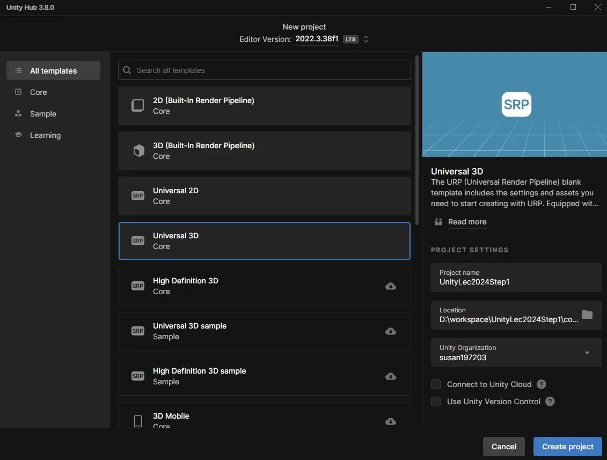
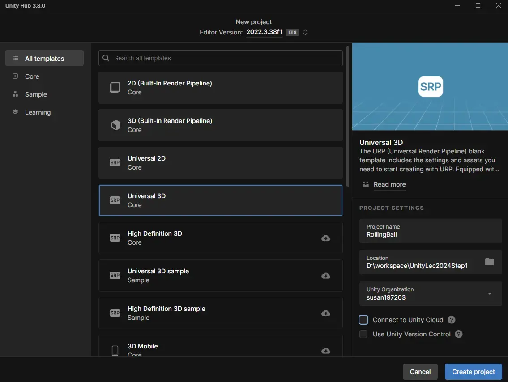

# 1. はじめに

* この記事は Unity 講習会 2024 入門編の資料です
* Unity Hub と Unity 2022.3.38f1 をインストール済み(※ 2022.3.38f1 はあくまで例)
* 任意の IDE がある(Visual studio, Rider など)

## 1.1. 題材

玉転がしゲームを作る

## 1.2. 学ぶこと

### 1.2.1. Component

* Transform
  * 座標移動
    * Quaternion は詳しく触れない
      * `Quaternion.Euler` で済ませる
  * 回転
* Rigidbody
  * 自由落下
  * AddForce
* Collider
  * SphereCollider 3D
    * OnCollision
    * OnTrigger
* Prefab
  * Mesh
    * 別にそんなに深く触れない
  * MeshRenderer
    * 別にそんなに深く触れない
* AudioSource
* AudioListener
* Camera
* Canvas
  * Text
  * Button
  * Image

### 1.2.2. Asset

* Folder
  * 特殊ディレクトリ
  * はじめは大文字で後は小文字
* Script
  * ファイル作成時にファイル名とクラス名に気をつける
    * クラス名はファイル名と同じにする
    * すべて英文字
* Texture
* Material
* AudioClip
* Prefab
* Scene

### 1.2.3. Script

* MonoBehaviour
* [SerializeField]
* Start
* Update
* FixedUpdate
* GetComponent
* OnCollisionEnter
* OnTriggerEnter
* Instantiate
* Destroy
* AddForce
* AusioSource.Play
* AusioSource.PlayOneShot
* Input.GetKey

## 1.3. ゲーム仕様

* 起動したらタイトル
* スペース押してタイトル消えてスコアとアイテムが初期化される
* "WASD" で玉を操作
* 玉がアイテムに触れたらスコアが増える
* スコアが 10 になったらゲームクリア
* ゲームオーバーかゲームクリアしたらタイトルに戻る
* 加速タイルに乗ったら玉が加速する
* 動く足場とかも作る
* 玉が穴に落ちたらゲームオーバー

# 2. プロジェクトを作る

## 2.1. Unity Hub でプロジェクトを作る

1. Unity Hub を起動

* `New Project` ボタンを押す

2. `Universal 3D` を選択

* `Project Name` は自由 (写真の例では `RollingBall` と入力)

3. `location` は自由 (特に気にしなければそのままで OK )
4. `Connect to Unity Cloud` はチェックを外す
5. `Use Unity Version Control` はチェックを外す
6. `Create project` ボタンを押す

7. こんな感じに鳴ってればOK

以下のタブが見えています。

* Scene
* Game
* Hierarchy
* Project
* Inspector
* Console

# 3. フィールドを作る

ここでは、玉転がしゲームのフィールドを作ります

## 3.1. 地面を作る
