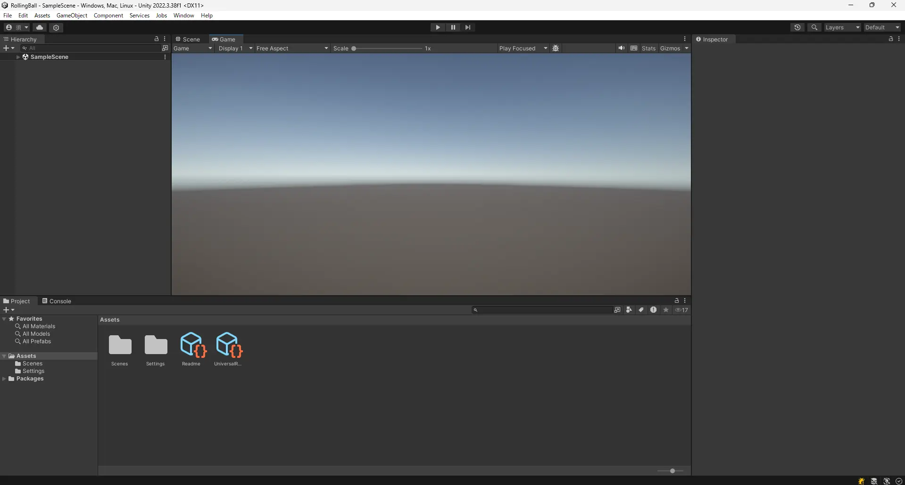
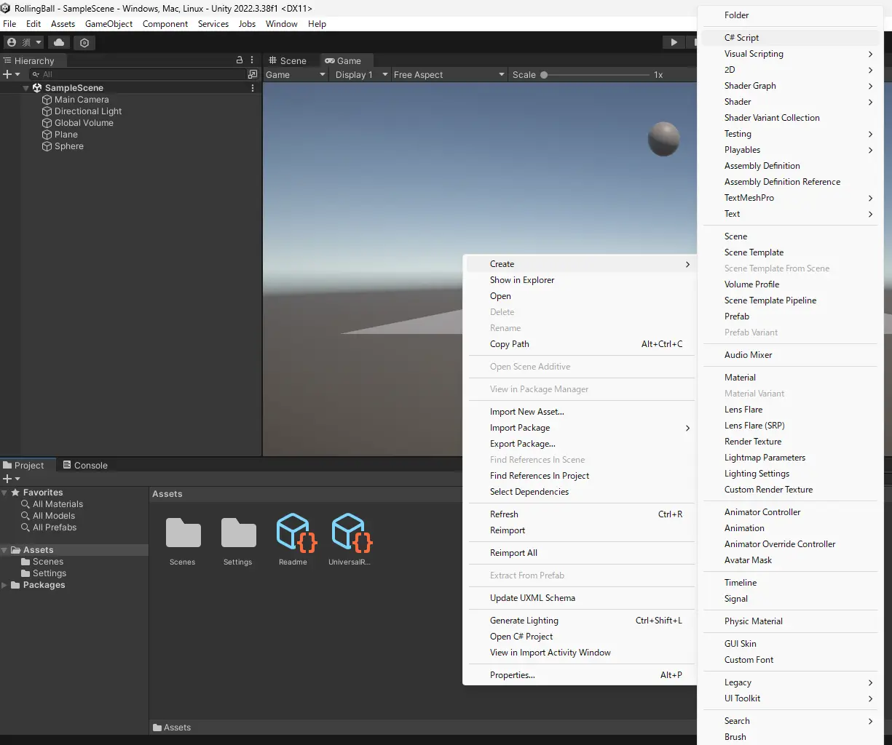
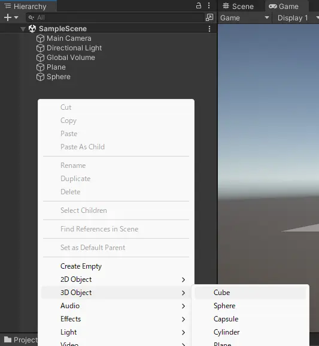
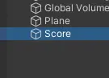
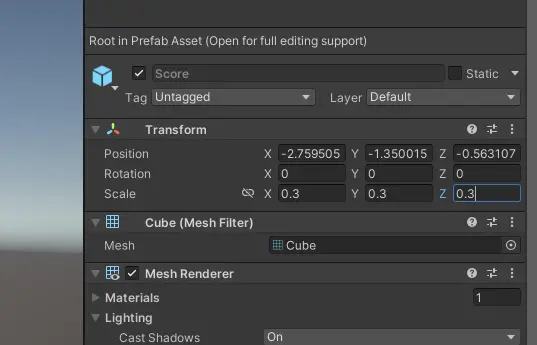

# 1. はじめに

* この記事は Unity 講習会 2024 入門編の資料です
* Unity Hub と Unity 2022.3.38f1 をインストール済み(※ 2022.3.38f1 はあくまで例)
* 任意の IDE がある(Visual studio, Rider など)

## 1.1. 題材

玉転がしゲームを作る

## 1.2. 学ぶこと

### 1.2.1. Component

* Transform
  * 座標移動
    * Quaternion は詳しく触れない
      * `Quaternion.Euler` で済ませる
  * 回転
* Rigidbody
  * 自由落下
  * AddForce
* Collider
  * SphereCollider 3D
    * OnCollision
    * OnTrigger
* Prefab
  * Mesh
    * 別にそんなに深く触れない
  * MeshRenderer
    * 別にそんなに深く触れない
* AudioSource
* AudioListener
* Camera
* Canvas
  * Text
  * Button
  * Image

### 1.2.2. Asset

* Folder
  * 特殊ディレクトリ
  * はじめは大文字で後は小文字
* Script
  * ファイル作成時にファイル名とクラス名に気をつける
    * クラス名はファイル名と同じにする
    * すべて英文字
* Texture
* Material
* AudioClip
* Prefab
* Scene

### 1.2.3. Script

* MonoBehaviour
* [SerializeField]
* Start
* Update
* FixedUpdate
* GetComponent
* OnCollisionEnter
* OnTriggerEnter
* Instantiate
* Destroy
* AddForce
* AusioSource.Play
* AusioSource.PlayOneShot
* Input.GetKey

## 1.3. ゲーム仕様

* 起動したらタイトル
* スペース押してタイトル消えてスコアとアイテムが初期化される
* "WASD" で玉を操作
* 玉がアイテムに触れたらスコアが増える
* スコアが 10 になったらゲームクリア
* ゲームオーバーかゲームクリアしたらタイトルに戻る
* 加速タイルに乗ったら玉が加速する
* 動く足場とかも作る
* 玉が穴に落ちたらゲームオーバー

# 2. プロジェクトを作る

## 2.1. Unity Hub でプロジェクトを作る

1. Unity Hub を起動

* `New Project` ボタンを押す

2. `Universal 3D` を選択

* `Project Name` は自由 (写真の例では `RollingBall` と入力)

3. `location` は自由 (特に気にしなければそのままで OK )
4. `Connect to Unity Cloud` はチェックを外す
5. `Use Unity Version Control` はチェックを外す
6. `Create project` ボタンを押す


7. こんな感じに鳴ってればOK



以下のタブが見えています。

* Scene
  * シーンを編集する
* Game
  * レンダリングされたゲーム画面
* Hierarchy
  * シーンに配置されたオブジェクトのリスト
* Project
  * プロジェクトのファイル一覧(エクスプローラーのようなもの)
* Inspector
  * 選択したオブジェクトのプロパティ
* Console
  * ログの表示


# 3. フィールドを作る

ここでは、玉転がしゲームのフィールドを作ります

## 3.1. 地面を作る

Hierarchyで右クリック -> 3D Object -> Plane を選択


Hierarchyに`Plane`が追加され、板が現れました！


Hierarchyで`Plane`を選択すると、Inspectorに`Plane`のプロパティが表示されます。

`Plane`には`Trasform`, `Mesh Filter`, `Mesh Renderer`, `Mesh Collider`の要素(Component)がついています。それぞれの役針は以下の通りです。

* Transform
  * 座標や傾きといった3D空間の位置情報プロパティ

* Mesh Filter, Mesh Renderer
  * レンダリングに関するプロパティ

* Collider (Mesh Collider)
  * 3Dモデルに当たり判定をつけるプロパティ

* (Material)
  * マテリアルを設定するプロパティ

## 3.2. ボールを作る

Hierarchyで右クリック -> 3D Object -> Sphere を選択


このままでは地面にめり込んでいるので、`Trasform`の`Position`を(0, 5, 0)に変更します。


いい感じの位置になりました！


# 4. ボールを重力で落下させる

ここでは、ボールを重力で落下させます。

## 4.1. Rigidbody を追加する

ゲームオブジェクトに物理演算を追加するには、Unity の物理演算の要素の `Rigidbody` を追加します。

`Hierarchy`で`Sphere`を選択し、`Inspector`で下の方にある`Add Component` -> `Physics` -> `Rigidbody` をクリック


`Sphere`に`Rigidbody`が追加されました！


上の方にある再生ボタンを押してみてください。ボールが落下します。


ボールが自由落下するのを確認できたら、必ず再生ボタンを押して再生を停止してください。

# 5. ボールを操作する

ここでは、ボールを操作するためのスクリプトを作成します。

## 5.1. スクリプトを作成する

`Project`タブで右クリック -> `Create` -> `C# Script` を選択



このとき、ファイル名を `BallController` に変更してください。


`BallController`　をダブルクリックして開くと、visual studio が起動します。(※このとき、visual studio が起動しなかった場合、TAの人にお知らせください)


`BallController.cs` が開かれていることを確認してください。`.cs` は C# の拡張子です。(C言語だと`.c`, C++だと`.cpp`, pythonだと`.py`)

## 5.2. スクリプトを書き換える

以下のようにスクリプトを書き換えてください。プログラムの説明は後で行います。

```csharp title="BallController.cs" showLineNumbers
using System.Collections;
using System.Collections.Generic;
using UnityEngine;

public class PlayerController : MonoBehaviour
{
+   private Rigidbody rb;

    // Start is called before the first frame update
    void Start()
    {
+       rb = GetComponent<Rigidbody>();
    }

    // Update is called once per frame
    void Update()
    {
+       if(Input.GetKey(KeyCode.W))
+       {
+           rb.AddForce(new Vector3(0, 0, 1));
+       }
+       if(Input.GetKey(KeyCode.S))
+       {
+           rb.AddForce(new Vector3(0, 0, -1));
+       }
+       if(Input.GetKey(KeyCode.A))
+       {
+           rb.AddForce(new Vector3(-1, 0, 0));
+       }
+       if(Input.GetKey(KeyCode.D))
+       {
+           rb.AddForce(new Vector3(1, 0, 0));
+       }
    }
}
```

## 5.3. スクリプトを Sphere にアタッチする

Project にある `BallController` を `Sphere` にドラッグアンドドロップしてください。


すると、`Sphere` の Inspector に `BallController` がコンポーネントとして追加されるのがわかります。これで、スクリプトをゲームオブジェクトにアタッチできました。

## 5.4. ゲームを再生してみる

再生ボタンを押してみてください。`W`, `A`, `S`, `D` キーを押すと、ボールが前後左右に動くことがわかります。(周りに壁とか無いから落ちるけど...)


確認ができたら、再生ボタンを押して再生を停止してください。

# 5.5. プログラムの説明

`BallController` をダブルクリックして開いてください。

変数 `rb` は `Rigidbody` 型の変数です。任意のゲームオブジェクトに付いている `Rigidbody` コンポーネントを代入することで、その `Rigidbody` を**参照**できます。

`Start` 関数は、再生ボタンを押したら最初に一度だけ実行される関数です。 Unity が呼び出してくれます。ここでは、Start 関数の中で、そのスクリプトがアタッチしている `Rigidbody` コンポーネントを `GetComponent` 関数で取得しています。`GetComponent` 関数は、アタッチしているゲームオブジェクトの指定したコンポーネントを取得する関数です。ここでは、`Rigidbody` コンポーネントを指定しています。

`Update` 関数は、再生ボタンを押したら毎フレーム実行される関数です。 Unity が呼び出してくれます。ここでは、 `Input.GetKey` 関数を使って、引数で指定されたキーボードのキーが入力されたかをif文で判定し、入力されたら `Rigidbody` の `AddForce` 関数を使って、ボールに力を加えています。 `Input.GetKey` 関数では、引数で指定されたキーボードのキーが押されている間、true を返します。そうでなければ、false を返します。 `AddForce` 関数は、引数で指定された方向に力を加えます。`w` キーが押されたら、Z軸に対して正の方向、`s` キーが押されたら、Z軸に対して負の方向、`a` キーが押されたら、X軸に対して負の方向、`d` キーが押されたら、X軸に対して正の方向に力を加えます。力の大きさはそれぞれ 1 です。`new Vector3` で Unity のベクトル情報を生成し、`AddForce` 関数の引数に渡しています。

# 6. 得点を生成させる

ここでは、ステージ上に得点をランダムな場所に生成させます。

## 6.1. 得点となるゲームオブジェクトのPrefabを作成する

`Hierarchy`で右クリック -> `3D Object` -> `Cube` を選択



オブジェクト名は `Score` に変更してください。ゲームオブジェクトを選択して F2 キーを押すか、右クリックして `Rename` を選択して名前を変更できます。



`Score` を Project にドラッグアンドドロップしてください。 Prefab として保存されます。


Prefab とは、ゲームオブジェクトの設計図のようなものです。ゲームオブジェクトそのものではありません。

`Score` の Prefab が作成できたら、 Hierarchy にある `Score` を削除してください。削除は、ゲームオブジェクトを選択して Delete キーを押すか、右クリックして `Delete` を選択して削除できます。

## 6.2. ScoreManager を作成する

得点のオブジェクトを生成するスクリプトを作成します。

`Project`タブで右クリック -> `Create` -> `C# Script` を選択

スクリプトの名前を `ScoreManager` に変更してください。


`ScoreManager` をダブルクリックして開いてください。

以下のようにスクリプトを書き換えてください。プログラムの説明は後で行います。

```csharp title="ScoreManager.cs" showLineNumbers
using System.Collections;
using System.Collections.Generic;
using UnityEngine;

public class ScoreManager : MonoBehaviour
{
+   [SerializeField] private GameObject ScoreObject;
+   [SerializeField] private int ScoreAmount = 10;

    // Start is called before the first frame update
    void Start()
    {
+       for (int i = 0; i < ScoreAmount; i++)
+       {
+           float x = Random.Range(-10, 10);
+           float z = Random.Range(-10, 10);
+           Instantiate(ScoreObject, new Vector3(x, 0.5f, z), Quaternion.identity);
+       }
    }

    // Update is called once per frame
    void Update()
    {
        
    }
}
```

Hierarchy で右クリック -> `Create Empty` を選択

ゲームオブジェクト名を `ScoreManager` に変更してください。


EnptyObject は、コンポーネントが何もついていないゲームオブジェクトです。このゲームオブジェクトに`ScoreManager`をアタッチします。

`ScoreManager` を Project から Hierarchy にドラッグアンドドロップしてください。そして、`ScoreManager` の Inspector にある `Score Object` に `Score` の Prefab をドラッグアンドドロップしてください。


再生ボタンを押してみてください。ステージ上にランダムな位置に `Score` が生成されることがわかります。


確認ができたら、再生ボタンを押して再生を停止してください。

少し Score が大きいので、 `Score` の `Scale` を (0.3, 0.3, 0.3) に変更してください。




